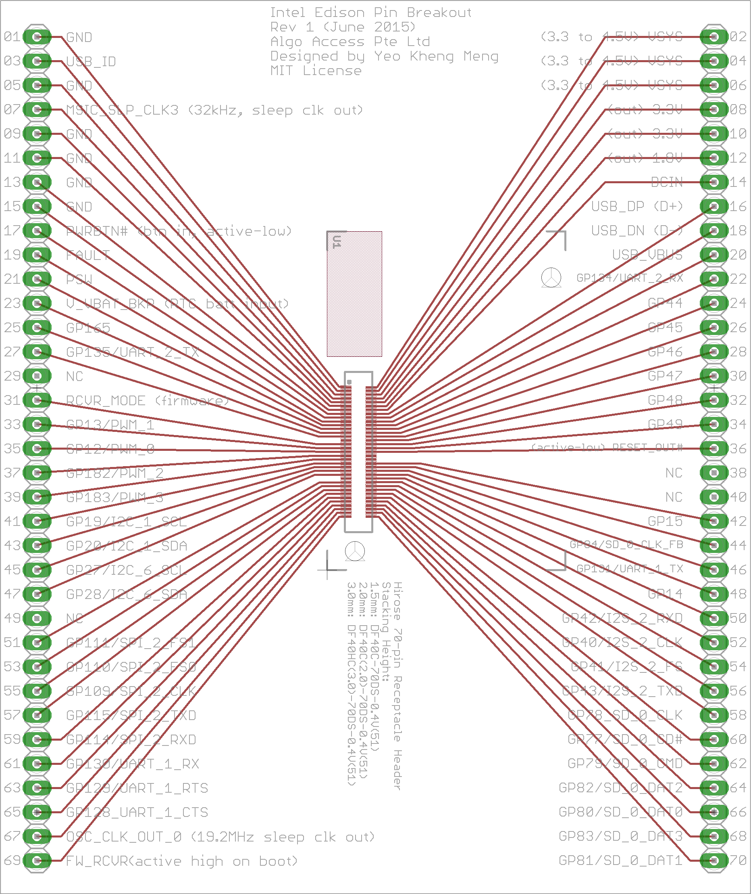

# intel-edison-pin-breakout
Pin breakout of the Intel Edison Hirose connector to through-hole pin headers for prototyping.

##PCB Design software and addons used

1. Eagle 7.3.0: I use Standard but Light should still be able to open/modify the files.
2. Intel Edison library by [Sparkfun](https://github.com/sparkfun/Sparkfun_Blocks_Template) (in repo as Edison.lbr)

##Schematic drawings

Images are exported from Eagle at 600dpi.

##Parts required

1) Hirose 70-pin DF40 Series Receptacle Connector. Such as the following taken from [Intel's website](http://www.intel.com/support/edison/sb/CS-035260.htm).

| Hirose part number        | Stacking height | Digi-key part number                 | Mouser part number   |
|---------------------------|-----------------|--------------------------------------|----------------------|
| DF40C-70DS-0.4V(51)       | 1.5 mm          | H11631TR-ND, H11631CT-ND, H11631DKR-ND | 798-DF40C70DS04V51   |
| DF40C(2.0)-70DS-0.4V(51)  | 2.0 mm          | H11908TR-ND, H11908CT-ND, H11908DKR-ND | 798-DF40C2070DS04V51 |
| DF40HC(3.0)-70DS-0.4V(51) | 3.0 mm          | n/a                                  |                      |

2) 2x 35-pin through-hole pin-headers

##PCB fabrication

PCB fabrication is currently done by [Seeedstudio](https://www.seeedstudio.com/service/index.php?r=pcb) based on the following settings. Remember to consult the [order submission guidelines](http://support.seeedstudio.com/knowledgebase/articles/422482-fusion-pcb-order-submission-guidelines) before submitting. Use the provided Gerber generator to produce the Gerber files.

Seeedstudio requires the following gerber files to be zipped up for submission:

1. Top Layer: pcbname.GTL
2. Top Solder Mask: pcbname.GTS
3. Top Silkscreen: pcbname.GTO
4. Bottom Layer: pcbname.GBL
5. Bottom Solder Mask: pcbname.GBS
6. Bottom silkscreen: pcbname.GBO
7. Board Outline:pcbname.GML/GKO
8. Drills: pcbname.TXT
9. Inner Layer: pcbname.GL2(for 4 layer)
10. Inner Layer: pcbname.GL3(for 4 layer)

The zip file has been uploaded to the Releases section.

###My Fabrication Settings: 

1. Layer: 1
2. PCB Dimension: 10cm Max * 10cm Max
3. PCB Thickness: 1.6mm
4. PCB Qty: 10
5. PCB Color: Green
6. Surface Finish: Hasl(Lead Free)
7. Copper weight: 1oz
8. Panalized PCBs: 1
9. Expedited Option: No
10. PCB Stencil: checked
11. No Fiducial
12. 0.12mm
13. 

13. 37.0cm * 47.0cm
14. Polishing

##References
1. [Intel Edison Module Hardware guide](http://www.intel.com/support/edison/sb/CS-035274.htm)
2. [Sparkfun Intel Edison layout diagram](https://cdn.sparkfun.com/assets/learn_tutorials/3/2/2/edison-pinout.pdf)
